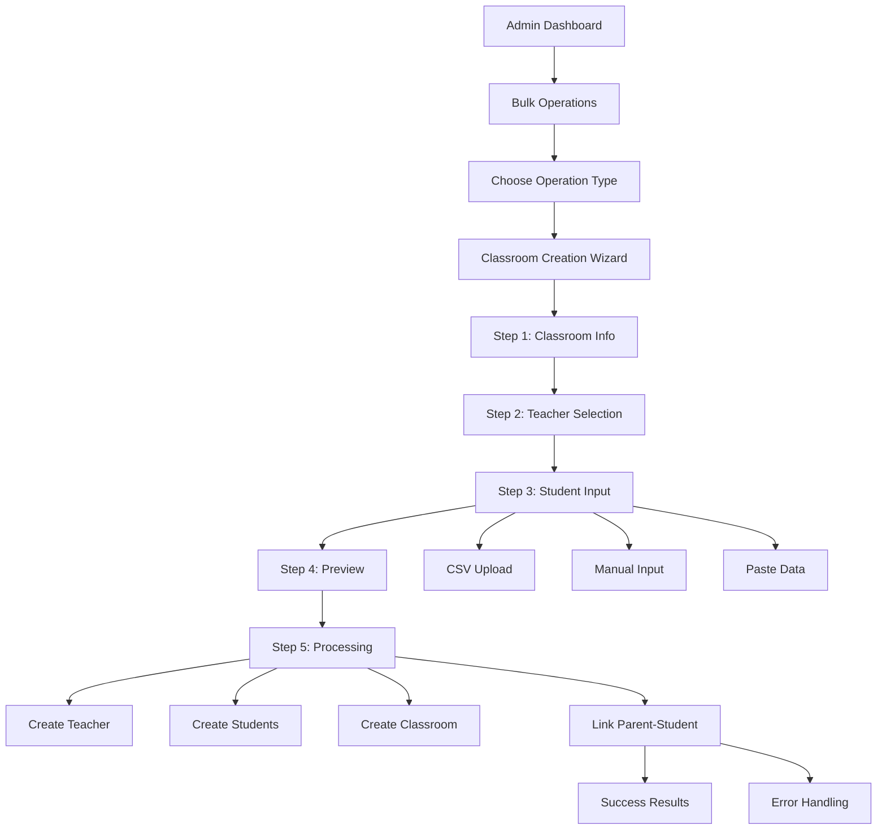

# 🚀 Bulk Operations System - Hệ thống Tạo Hàng loạt

## 📋 Tổng quan

Hệ thống Bulk Operations cho phép Admin và Super Admin tạo lớp học cùng với nhiều học sinh và giáo viên một cách nhanh chóng và hiệu quả. Đây là giải pháp tối ưu để tiết kiệm thời gian setup cho các trường học.

## ✨ Tính năng chính

### 🎯 **Bulk Classroom Creation**
- ✅ Tạo lớp học với giáo viên và nhiều học sinh cùng lúc
- ✅ Hỗ trợ upload CSV/Excel hoặc nhập thủ công
- ✅ Tự động tạo mật khẩu an toàn
- ✅ Tạo liên kết phụ huynh - học sinh tự động
- ✅ Validation và duplicate detection
- ✅ Progress tracking real-time
- ✅ Error handling chi tiết

### 🔧 **Advanced Features**
- ✅ Wizard UI với 5 bước trực quan
- ✅ Multiple input methods (CSV, paste, manual)
- ✅ Template download
- ✅ Audit logging
- ✅ Export login credentials
- ✅ Operation history

## 🏗️ Kiến trúc hệ thống

```
src/
├── types/bulk-operations.ts          # Type definitions
├── lib/bulk-operations/              # Core logic
│   ├── validators.ts                 # Validation functions
│   ├── csv-parser.ts                 # CSV processing
│   ├── bulk-processor.ts             # Main processing logic
│   └── utils.ts                      # Utility functions
├── components/admin/bulk/            # UI Components
│   ├── BulkClassroomWizard.tsx      # Main wizard
│   └── steps/                       # Wizard steps
│       ├── ClassroomInfoStep.tsx
│       ├── TeacherSelectionStep.tsx
│       ├── StudentInputStep.tsx
│       ├── PreviewStep.tsx
│       └── CompletionStep.tsx
├── hooks/admin/                     # Custom hooks
│   └── use-bulk-operations.ts
└── app/api/admin/bulk/              # API endpoints
    ├── classrooms/route.ts
    ├── classrooms/[operationId]/route.ts
    └── templates/route.ts
```

## 🚀 Cách sử dụng

### 1. **Truy cập trang Bulk Operations**
```
/dashboard/admin/bulk
```

### 2. **Chọn "Tạo lớp học hàng loạt"**

### 3. **Làm theo Wizard 5 bước:**

#### **Bước 1: Thông tin lớp học**
- Nhập tên lớp học (bắt buộc)
- Chọn icon, mô tả
- Thiết lập số lượng học sinh tối đa
- Chọn khối lớp, môn học

#### **Bước 2: Chọn giáo viên**
- **Option A**: Chọn giáo viên có sẵn
  - Tìm kiếm theo email/tên
  - Chọn từ danh sách kết quả
- **Option B**: Tạo giáo viên mới
  - Nhập email, họ tên
  - Mật khẩu (tự động tạo nếu để trống)

#### **Bước 3: Thêm học sinh**
- **Method 1**: Upload CSV/Excel
  - Tải template CSV
  - Điền thông tin học sinh
  - Upload file
- **Method 2**: Paste từ clipboard
  - Copy từ Excel/Google Sheets
  - Paste vào ô text
- **Method 3**: Nhập thủ công
  - Thêm từng học sinh một

#### **Bước 4: Xem trước**
- Kiểm tra tất cả thông tin
- Xem thống kê
- Xác nhận tạo lớp học

#### **Bước 5: Hoàn thành**
- Xem kết quả
- Download thông tin đăng nhập
- Truy cập lớp học đã tạo

## 📊 CSV Template Format

### **Student Template**
```csv
Email,Họ và tên,Email phụ huynh,Mã học sinh,Khối lớp,Mật khẩu
hocsinh1@example.com,Nguyễn Văn A,phuhuynh1@example.com,HS001,12,
hocsinh2@example.com,Trần Thị B,phuhuynh2@example.com,HS002,12,password123
```

### **Teacher Template**
```csv
Email,Họ và tên,Mật khẩu
giaovien@example.com,Nguyễn Thị C,
```

## 🔧 API Endpoints

### **POST /api/admin/bulk/classrooms**
Tạo lớp học hàng loạt

**Request Body:**
```typescript
{
  name: string;
  description?: string;
  icon?: string;
  maxStudents?: number;
  code?: string;
  teacherEmail?: string;
  teacherData?: {
    email: string;
    fullname: string;
    password?: string;
  };
  students: BulkUserInput[];
  organizationId?: string;
  grade?: string;
  subject?: string;
}
```

**Response:**
```typescript
{
  success: boolean;
  data?: BulkClassroomResult;
  errors?: string[];
  warnings?: string[];
  meta: {
    duration: number;
    timestamp: string;
    operationId: string;
  };
}
```

### **GET /api/admin/bulk/classrooms/[operationId]**
Lấy progress của operation

### **GET /api/admin/bulk/templates**
Download CSV templates

**Query Parameters:**
- `type`: 'student' | 'teacher'
- `example`: boolean (default: true)

## 🛡️ Security & Permissions

### **Role Requirements**
- **ADMIN**: Có thể tạo bulk classroom trong organization của mình
- **SUPER_ADMIN**: Có thể tạo bulk classroom cho mọi organization

### **Validation**
- ✅ Email format validation
- ✅ Duplicate email detection
- ✅ Required fields validation
- ✅ Role permission checks
- ✅ Organization membership validation

### **Rate Limiting**
- Bulk operations: 10 requests/hour per user
- Template download: 60 requests/hour per IP

## 📈 Performance Optimizations

### **Database**
- Transaction-based operations
- Batch processing for large datasets
- Optimized queries with proper indexes
- Connection pooling

### **Frontend**
- Lazy loading components
- Debounced search
- Virtual scrolling for large lists
- Progress streaming

### **Memory Management**
- Streaming CSV processing
- Chunked file uploads
- Garbage collection optimization
- Memory leak prevention

## 🐛 Error Handling

### **Validation Errors**
```typescript
{
  row: number;
  field: string;
  message: string;
  value?: any;
}
```

### **Processing Errors**
- Individual user creation failures
- Database constraint violations
- Network timeouts
- Memory limitations

### **Recovery Mechanisms**
- Partial success handling
- Rollback capabilities
- Retry logic
- Error reporting

## 📊 Monitoring & Logging

### **Audit Logs**
Tất cả bulk operations được log với:
- Actor ID và role
- Operation type và parameters
- Success/failure status
- Duration và metadata

### **Metrics**
- Operation success rates
- Processing times
- Error frequencies
- User adoption

## 🔄 Workflow Diagram



## 🧪 Testing

### **Unit Tests**
```bash
npm test src/lib/bulk-operations/
```

### **Integration Tests**
```bash
npm test src/app/api/admin/bulk/
```

### **E2E Tests**
```bash
npm run test:e2e -- --spec="bulk-operations"
```

## 📝 Changelog

### **v1.0.0** (Current)
- ✅ Initial bulk classroom creation
- ✅ CSV upload support
- ✅ Progress tracking
- ✅ Error handling
- ✅ Audit logging

### **v1.1.0** (Planned)
- 🔄 Bulk user creation
- 🔄 Bulk course creation
- 🔄 Email notifications
- 🔄 Advanced templates

## 🤝 Contributing

1. Fork the repository
2. Create feature branch: `git checkout -b feature/bulk-operations-enhancement`
3. Commit changes: `git commit -am 'Add new bulk feature'`
4. Push to branch: `git push origin feature/bulk-operations-enhancement`
5. Submit pull request

## 📞 Support

- **Documentation**: `/docs/BULK_OPERATIONS.md`
- **API Reference**: `/docs/api/bulk-operations.md`
- **Issues**: GitHub Issues
- **Discord**: #bulk-operations channel

## 📄 License

MIT License - see LICENSE file for details.

---

**Developed with ❤️ for efficient school management**
